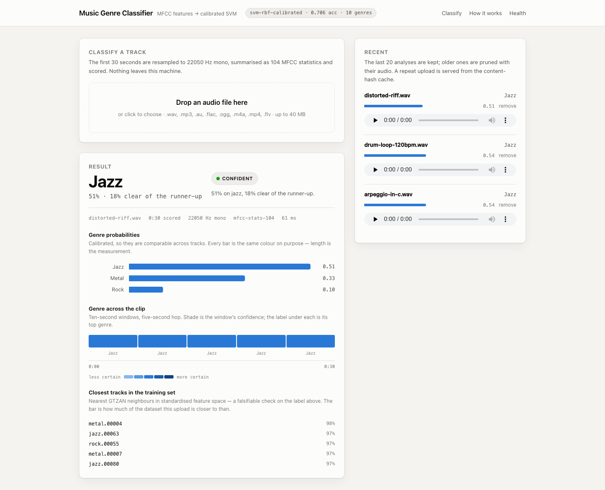
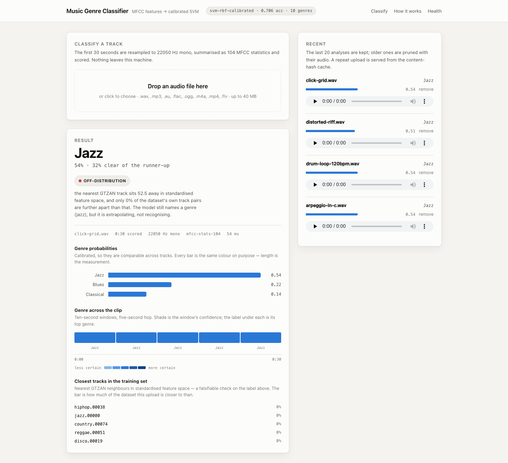
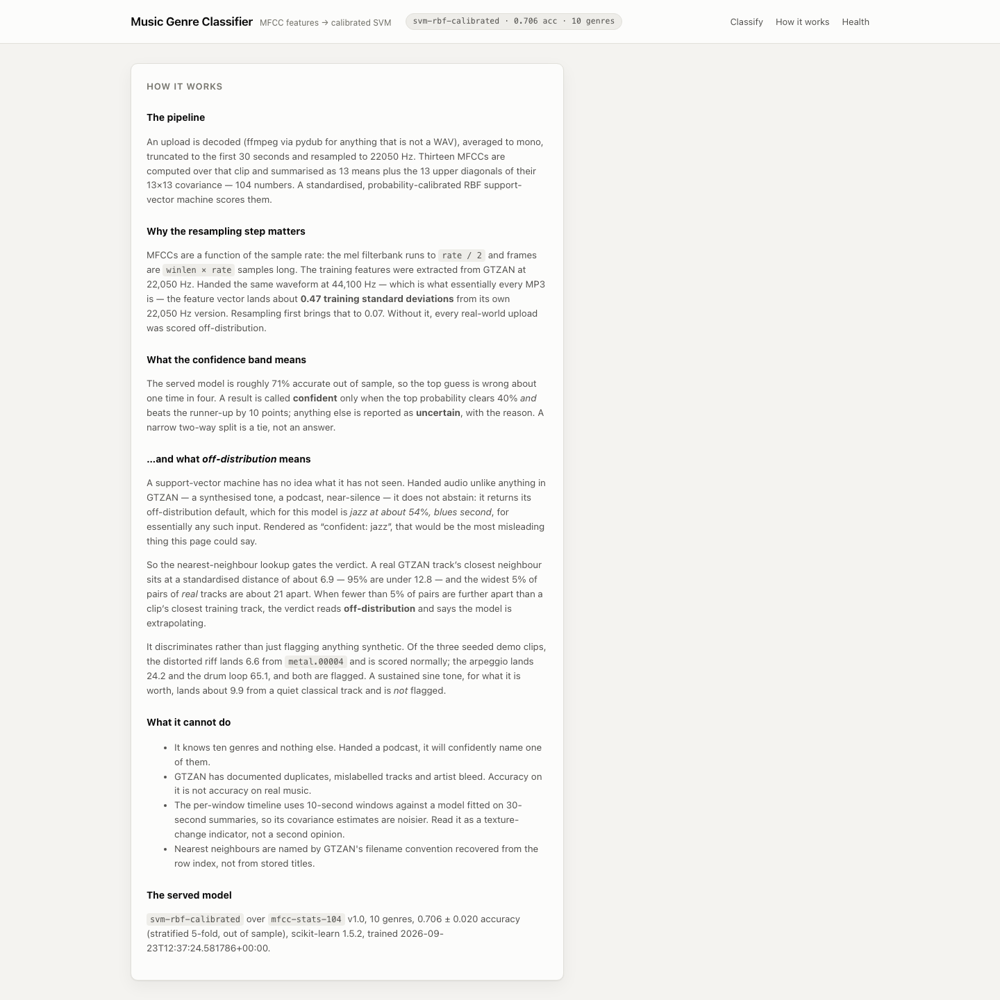
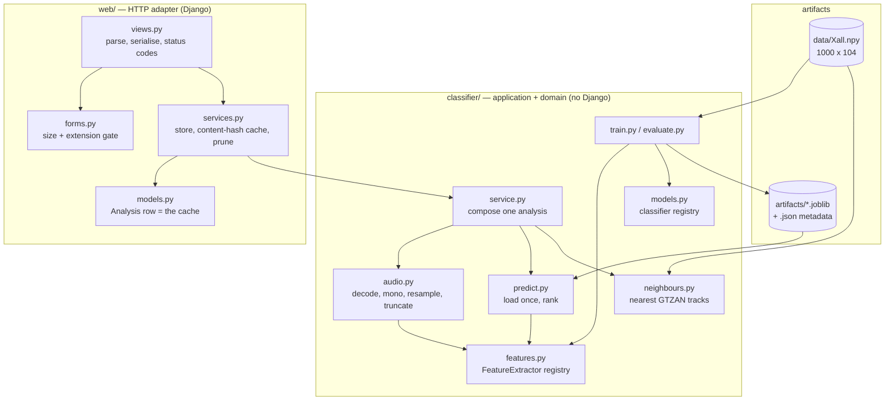
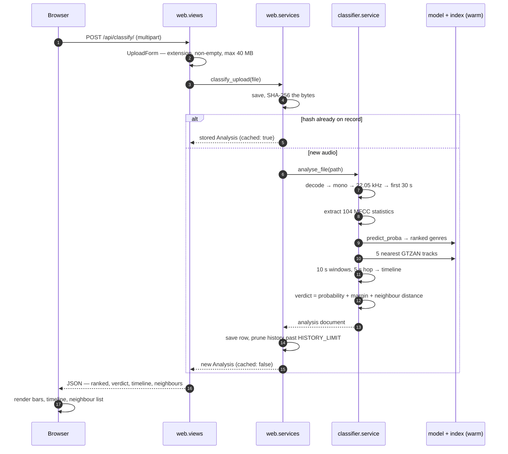

# Music Genre Classifier

Upload a track and get a ranked genre prediction from a calibrated support-vector
machine over 104 MFCC statistics, trained on the GTZAN collection. Alongside the
probabilities it shows a per-window timeline, the nearest tracks in the training
set, and an explicit verdict on whether the model is recognising the audio or
extrapolating past anything it has seen.

The original project compared five classifiers and published an accuracy table
with no code behind it. Making that table reproducible found that its central
conclusion was backwards — the section [**The correction**](#the-correction)
below has the measurements.

---

## Screenshots

A completed analysis. The label is *jazz* at 0.51, but the closest training
tracks are `metal.00004` and `rock.00055` — the neighbour panel is a falsifiable
check on the label above it, not decoration.



The same page for audio that is nothing like the training set. An SVM does not
abstain, so the nearest-neighbour distance is used to say so explicitly rather
than letting a 54% answer read as confidence.



The **How it works** page states the pipeline, the measured effect of
resampling, what each confidence band means, and what the thing cannot do.



---

## Architecture

Three layers, dependencies pointing inward. `web/` knows about `classifier/`;
`classifier/` has never heard of Django and imports nothing from it, which is
why the whole inference path can be exercised from a REPL or a test without a
request, a database or a settings module.



`features.py` is the piece that earns the layering: training and serving use one
extractor, and the extractor owns its own preprocessing contract (sample rate,
channels, clip length). Before that split there were two copies of the same
maths and they did not agree — see [Design notes](#design-notes).

## How a request flows



Failures take the same path in reverse and keep their meaning: an undecodable
file is a 400 naming the file and the reason, a model that will not load is a
503, and nothing returns `None`.

---

## Quickstart

```bash
docker compose up --build
```

Open **http://localhost:8310**. One command, no manual steps: the image trains
the model at build time from the feature matrix in the repository, and the
entrypoint migrates and seeds three analysed clips, so the first page is
populated rather than an empty form.

```bash
docker compose down -v      # stop, and drop the uploads volume
```

There is no dataset download and no API key. The GTZAN audio is ~1.2 GB and is
not ours to redistribute, so it is not here; the extracted features are, and
they are what every number in this README rests on.

The upload form accepts `.wav`, `.mp3`, `.au`, `.flac`, `.ogg`, `.m4a`, `.mp4`
and `.flv`, up to 40 MB. Only `.wav` is read directly; everything else goes
through pydub, which shells out to **ffmpeg** — the Docker image installs it, a
local checkout needs it on `PATH`.

---

## Configuration

Every setting is read from the environment with a development default, so the
same image runs locally and behind a real host without a second settings file.

| Variable | Required | Default | What it does |
|---|---|---|---|
| `SECRET_KEY` | in production | `dev-only-insecure-key-change-me` | Django signing key. The fallback is obviously not a secret. |
| `DEBUG` | no | `1` (compose sets `0`) | Debug pages. With `DEBUG=0` the app serves hashed static files through WhiteNoise, which is what the container does. |
| `ALLOWED_HOSTS` | in production | `localhost,127.0.0.1,0.0.0.0,[::1]` | Comma-separated host allowlist. |
| `CSRF_TRUSTED_ORIGINS` | behind a proxy | `http://localhost:8310` | Comma-separated origins allowed to POST. |
| `SECURE_COOKIES` | no | `1` when `DEBUG=0` | Secure-only session and CSRF cookies. Compose sets `0`: the demo is plain HTTP on localhost, where secure cookies are never stored and every POST would 403. Set it to `1` behind TLS. |
| `DATABASE_PATH` | no | `<repo>/db.sqlite3` | SQLite file. The container puts it on the `music_data` volume. |
| `MEDIA_ROOT` | no | `<repo>/media` | Where uploaded audio is stored. |
| `SERVE_MEDIA` | no | `1` | Serve uploaded audio back for in-page playback. Turn off when a web server or object store handles media. |
| `HISTORY_LIMIT` | no | `20` | How many analyses to keep. Every successful classification prunes past this, with the audio. |
| `WARM_MODEL` | no | `1` | Run one full analysis at process start so the first request is not the one that pays for it. |
| `LOG_LEVEL` | no | `INFO` | Root log level. |
| `TIME_ZONE` | no | `UTC` | Django time zone. |
| `PORT` | no | `8000` | Port gunicorn binds (`Procfile`). |
| `WEB_CONCURRENCY` | no | `2` | Gunicorn worker count (`Procfile`). |

---

## Development

Python 3.11 or 3.12. Newer versions have no wheels for the pinned numpy and
scikit-learn.

```bash
python3.12 -m venv project_venv
./project_venv/bin/pip install -r requirements.txt -r requirements-dev.txt

./project_venv/bin/python -m classifier.train      # writes artifacts/
./project_venv/bin/python manage.py migrate
./project_venv/bin/python manage.py seed_demo      # populate the history
./project_venv/bin/python manage.py runserver 0.0.0.0:8310
```

```bash
./project_venv/bin/python -m pytest                # 198 tests, ~12 s
./project_venv/bin/ruff check .                    # lint
./project_venv/bin/ruff check --fix .              # and fix

./project_venv/bin/python -m classifier.evaluate --raw   # regenerate the table below
./project_venv/bin/python -m classifier.train --six      # the six-genre variant
./project_venv/bin/python -m classifier.train --classifier logistic-regression
```

`project_venv/`, `artifacts/`, `media/`, `staticfiles/` and `db.sqlite3` are all
gitignored. Nothing in the test suite needs the GTZAN audio, a GPU, a network
download, or a training run longer than a second or two: feature matrices and
models are synthesised from a fixed seed in `tests/conftest.py`, and the audio
tests generate their own WAVs.

---

## Project structure

```
classifier/                  the pipeline — imports no Django
├── features.py              FeatureExtractor protocol + registry; the ONE
│                            extractor training and serving both use
├── audio.py                 decode → mono → resample → truncate → clip
├── data.py                  feature matrix + label reconstruction
├── models.py                classifier registry; every candidate is scaled
├── train.py                 fit, persist, record what produced the artifact
├── evaluate.py              reproducible benchmark → the table below
├── predict.py               load once, rank, refuse a mismatched extractor
├── neighbours.py            nearest GTZAN tracks + the OOD distance
└── service.py               composes one analysis; the layer views call
web/                         Django app — a thin HTTP adapter
├── views.py                 parse, delegate, serialise, status codes
├── forms.py                 the size and extension gate
├── services.py              store, content-hash cache, history pruning
├── models.py                Analysis — one row per analysed upload
├── apps.py                  startup warm-up
├── management/commands/
│   └── seed_demo.py         synthesise and really classify three clips
├── templates/web/           base, index, about
└── static/web/              one stylesheet, one script, no framework
config/                      settings, URLs, WSGI/ASGI
data/Xall.npy                1000 x 104 features — what everything rests on
artifacts/                   trained model + metadata (gitignored, built)
docs/screenshots/            the images above
tests/                       198 tests
├── conftest.py              synthetic features, models and WAVs
├── test_features.py         the extractor, pinned against the 2017 maths
├── test_audio.py            decode, resample, truncate, failure modes
├── test_data.py             loading and label reconstruction
├── test_train.py            what the persisted metadata claims
├── test_evaluation.py       the benchmark protocol
├── test_predict.py          the artifact in artifacts/ (skips if absent)
├── test_prediction_path.py  persist → load → rank, on synthetic data
├── test_service.py          verdicts, timeline, cache key, analysis shape
├── test_neighbours.py       the index, the ordering, the track naming
├── test_seed.py             the model, the seed command, the warm-up
└── test_views.py            every endpoint, and the bugs they used to have
```

---

## Design notes

### Train/serve skew — it existed, and it is closed

The 104 features were produced in 2017 by `mysvm/feature.py`; the web app then
extracted its own features with a **second copy** of the same maths. The copies
did not agree. Two divergences, both measured:

- **Sample rate.** `python_speech_features` derives its mel filterbank from
  `highfreq = rate / 2` and frames at `winlen * rate` samples, so MFCCs are a
  function of the sample rate. GTZAN is 22,050 Hz; handed the same waveform at
  44,100 Hz — which is what essentially every MP3 a user owns actually is — the
  104-vector lands a mean of **0.47 training standard deviations** from its
  22,050 Hz self, and up to 1.94 SD on individual coefficients. Resampling first
  brings that to **0.07 SD**.
- **Channel count.** The training extractor passed stereo data straight to
  `mfcc`; the serving extractor averaged to mono. Worth 0.66 SD. GTZAN is mono,
  so the serving path happened to be the correct one — by accident.

There is now one extractor. It owns its preprocessing contract, that contract is
written into the model metadata, and `classifier.predict` **refuses to serve** a
model whose recorded extractor is not the installed one — because numbers that
look like predictions but were computed over a different feature definition are
worse than an error. `tests/test_features.py` pins the current extractor against
an independent transcription of the 2017 code, to twelve decimal places.

### Scalability — where the time actually goes

Measured, not guessed. A 30-second upload on a warm worker:

| Step | Median of 10, warm |
|---|---|
| decode + mono + resample + truncate | 0.3 ms |
| extract 104 MFCC statistics | 15 ms |
| `predict_proba` | 0.8 ms |
| timeline — 5 windows × (extract + predict) | 34 ms |
| nearest neighbours (index already built) | 0.2 ms |
| **one full analysis** | **48 ms** |

End to end through the page, including the upload and the database write, the
two screenshots above report 61 ms and 54 ms.

Four things keep it there:

1. **The model and the neighbour index load once per process**, behind
   `lru_cache`. Re-reading the joblib file per request would dominate the
   response.
2. **A full analysis runs at worker boot** (`web/apps.py`). This was the
   surprise: `python_speech_features` and the FFT under it cost ~0.9 s on their
   *first* call against ~0.05 s afterwards, and they warm **per input length** —
   so warming a one-second buffer does nothing for the ten-second timeline
   windows. Measured in the container: a cold upload took 4.9 s, then 1.7 s,
   then settled at ~0.35 s.
   Warming with a full 30-second analysis moves all of that into worker boot,
   inside the healthcheck's start period.
3. **Repeat uploads are a database lookup.** Inference is deterministic, so the
   SHA-256 of the file is a unique key: the same bytes twice produce a
   byte-identical answer, and re-running ~48 ms of extraction to get it is pure
   waste. The duplicate upload is discarded rather than stored twice.
4. **Everything is bounded.** The upload is size-capped *before* it is decoded
   and truncated to 30 seconds *before* it is resampled, so a long file cannot
   buy more work. `Analysis` is indexed on `sha256` and `created_at` — the only
   two queries this app makes are "find by hash" and "the most recent N" — the
   history endpoint clamps its `limit`, and every successful classification
   prunes the table and the media directory back to `HISTORY_LIMIT`. There is no
   `.all()` anywhere.

SQLite is the right database here and Postgres would be ceremony. The honest
next bottleneck is CPU: feature extraction is ~50 ms of single-threaded work per
clip, so past a handful of concurrent uploads the answer is a task queue and
more workers, not a different store.

### Extensibility — two registries, on the two axes that matter

`classifier/features.py` makes **how audio becomes numbers** swappable; a
mel-spectrogram CNN embedding would be another `FeatureExtractor` and nothing
outside that module would need to know. `classifier/models.py` makes **what
scores the numbers** swappable; a new classifier is a factory returning anything
with `fit`/`predict_proba`/`classes_`, registered under a name that
`classifier.train --classifier <name>` accepts.

Both names are written into the model metadata, so an artifact always says what
produced it, and a mismatch is refused at load rather than discovered in
production.

### The off-distribution verdict

A support-vector machine has no idea what it has not seen. Handed audio unlike
anything in GTZAN it does not abstain — it returns its off-distribution default,
which for this model is *jazz at about 0.54, blues second*, for essentially any
such input. Rendered as "confident: jazz", that is the single most misleading
thing this interface could say.

The neighbour index already answers the question, and it discriminates rather
than just flagging anything synthetic:

| Clip | Nearest GTZAN track | Distance | Verdict |
|---|---|---|---|
| a real track's typical neighbour | — | ~6.9 (95% under 12.8) | — |
| `distorted-riff.wav` | `metal.00004` | 6.6 | scored normally |
| a sustained sine tone | a quiet classical track | 9.9 | scored normally |
| `arpeggio-in-c.wav` | `jazz.00032` | 24.2 | off-distribution |
| `drum-loop-120bpm.wav` | `hiphop.00038` | 65.1 | off-distribution |

When fewer than 5% of GTZAN's own track pairs are further apart than a clip is
from its nearest one, the verdict says the model is extrapolating. The threshold
is a percentile of the dataset's own distance distribution rather than a magic
number, so it stays meaningful if the matrix is regenerated.

### The correction

The original README published this table with no code behind it:

| Classifier | Claimed test accuracy |
|---|---|
| K-Nearest Neighbors | 53% |
| Logistic Regression | 54% |
| SVM linear | 52% |
| SVM RBF | **12%** |
| **SVM poly** | **64%** ← recommended |

Measured over the same feature matrix, stratified 5-fold, fixed seed
(`python -m classifier.evaluate --raw`, reproduced again for this pass):

```
All 10 genres, standardised
classifier               train    test     sd    gap
----------------------------------------------------
SVM RBF                  0.928   0.728  0.025  0.201
Logistic Regression      0.981   0.719  0.018  0.262
SVM linear               0.996   0.710  0.010  0.286
K-Nearest Neighbors      0.767   0.639  0.029  0.128
SVM poly                 0.684   0.445  0.020  0.239
random baseline                  0.100
```

**The recommendation was backwards.** The polynomial kernel is the worst of the
five, not the best. RBF — reported at 12%, barely above the 10% you get by
guessing — is the best at 72.8%.

The cause: the 104 features are not on a common scale. Their standard deviations
run from 1.86 to 59.66, a factor of 32, and SVMs and k-NN both measure distances
in that raw space. Standardising is one line and it changes which model wins:

```
                        raw     standardised
SVM RBF                0.630 →     0.728      +9.8 points
Logistic Regression    0.647 →     0.719
SVM linear             0.670 →     0.710
K-Nearest Neighbors    0.614 →     0.639
SVM poly               0.542 →     0.445      (the only one scaling hurts)
```

A 12% result for RBF is so close to chance that it should have been read as a
broken setup rather than a property of the kernel. **A number that says "this
method does not work at all" usually means the method was not run correctly.**

The original also claimed 85% on a six-genre subset using the polynomial kernel.
The **85% is reproducible** — 84.8% — but not by the method described:

| | raw | standardised |
|---|---|---|
| SVM poly (the stated method) | 0.702 | 0.568 |
| SVM RBF | 0.777 | **0.848** |
| SVM linear | 0.812 | **0.853** |

The right answer, reached by the wrong route.

### The served model is not the best one on the table

The benchmark reports plain `SVC(kernel="rbf")` at **0.728**. The model actually
served is wrapped in `CalibratedClassifierCV` and scores **0.706** — 2.2 points
lower. That is a deliberate trade: the interface shows probabilities, and an
uncalibrated SVM's `predict_proba` is a Platt-scaled score fitted by an internal
cross-validation the caller never sees. At 71% accuracy the top guess is wrong
about one time in four, so a user who can see that the runner-up was close is
better served than one shown a confident-looking number that does not mean what
it appears to.

### What was deleted, and how it was checked first

21.8 MB of tracked files that nothing referenced. Each was confirmed dead by
grepping the whole tree for its path and by checking what actually loads it —
not by eyeballing the names.

| Removed | Size | Why it was dead |
|---|---|---|
| `mysvm/data/*.pkl` — five models | 1.8 MB | scikit-learn 0.18 pickles. Every installable version raises `ModuleNotFoundError: No module named 'sklearn.svm.classes'` (that module went in 0.22). Nothing in the tree referenced them. |
| `mysvm/*.py` — the 2017 research code | — | Uses `collections.Iterable`, removed in Python 3.10, so it cannot even import. Its maths is preserved in `classifier/features.py` and pinned by a test. |
| `fileupload/` — vendored front end | ~10 MB | AngularJS 1.1.5, jQuery, Bootstrap 3, Material Kit, FontAwesome and 19 background photographs, replaced by one stylesheet and one script with no dependencies. |
| `report.docx`, `report.pdf` | 5.4 MB | The 2017 coursework write-up. Not code, not documentation of the code. |
| `docs/screenshots/upload-ui.png` | 2.4 MB | A screenshot of the interface that no longer exists. |
| `arc.png`, `flowchart.png`, `img.jpg` | 0.5 MB | Diagram images, replaced by the Mermaid blocks above, which GitHub renders and a reviewer can diff. |
| `db` | 144 KB | A committed SQLite file: 22 applied migrations and **zero rows in every table**, checked before deleting. |
| `setup.py`, two `.DS_Store` files | — | This is an application, not a package. |

`mysvm/data/Xall.npy` was **moved**, not deleted — it is `data/Xall.npy` now, and
`shasum -a 256` confirms it is byte-identical. It is the one thing in that
directory that anything still loads.

### The labels are the fragile part

They are stored nowhere. They are implied by the row ordering of the feature
matrix — GTZAN is 10 genres of exactly 100 tracks, in alphabetical blocks — and
the 2017 code reconstructed them with `np.ones(n), np.ones(n)*2, ...`.
`classifier/data.py` reconstructs them in one place, explains the assumption,
and refuses to proceed if the matrix is not the shape that assumption requires,
because silently mislabelling every row would make every number here
meaningless. The same convention is what lets a row index recover the GTZAN
filename for the neighbour panel.

---

## Limitations

- **GTZAN is a flawed benchmark.** Documented duplicate tracks, mislabelled
  examples and artist bleed between splits. Accuracy on it is not accuracy on
  real music, and every figure here inherits that.
- **It knows ten genres and nothing else.** Handed a podcast it will name one of
  them. The off-distribution verdict catches the clearest cases; it is a
  distance threshold, not a classifier of "is this music".
- **The audio itself is not in the repository** — only the extracted features. The
  extraction path is tested against synthetic audio and pinned against the
  original code, but has not been re-validated against the original tracks.
- **The seeded demo clips are synthesised**, not real music. Nothing about their
  *analysis* is faked — each is written to disk, decoded and scored through
  exactly the path an upload takes — but two of the three land off-distribution,
  which is the honest answer rather than an impressive one.
- **Features are 2017-era.** MFCC means and covariances were a reasonable choice
  then; a small CNN over mel-spectrograms would very likely do better, and is
  the honest next step rather than tuning these five classifiers further. The
  `FeatureExtractor` seam exists so that is a new class, not a rewrite.
- **The timeline is noisier than the headline.** It scores 10-second windows with
  a model fitted on 30-second summaries, so its covariance estimates are worse
  estimates of the same quantity. Read it as a texture-change indicator, not a
  second opinion.
- **No confusion matrix in the interface.** Which genres get confused is more
  useful to a user than a single accuracy number.
- **One process, one machine.** No queue, no object storage, no horizontal scale.
  Uploads go to a local volume and the history is capped at 20 analyses; this is
  a demo you run, not a service you operate.
- **`DEBUG` defaults to on** locally and `SECRET_KEY` falls back to an obviously
  insecure literal. Set `DEBUG=0`, `SECRET_KEY`, `ALLOWED_HOSTS` and
  `SECURE_COOKIES=1` before exposing it to anything.
